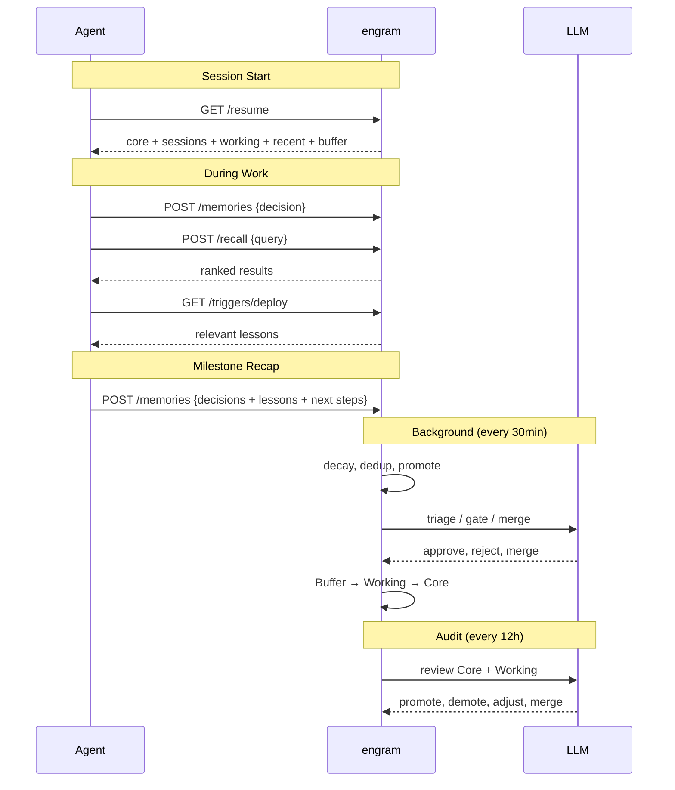

# engram

Persistent memory for AI agents. Store, forget, and recall like a brain.

<p align="center">
  
</p>

## Why?

Most agent memory is just a vector database. Everything stays forever, retrieval is dumb similarity search, and there's no concept of what matters.

engram is different. It uses a three-layer model inspired by [how human memory actually works](https://en.wikipedia.org/wiki/Atkinson%E2%80%93Shiffrin_memory_model):

| Layer | Role | Behavior |
|-------|------|----------|
| **Buffer** | Short-term intake | All new memories land here. Capacity-capped (FIFO overflow), unreinforced entries decay naturally |
| **Working** | Active knowledge | Promoted from Buffer when accessed repeatedly, reinforced by duplicates, or tagged as lessons/procedures |
| **Core** | Long-term identity | Promoted from Working through sustained usage and LLM quality gate. Procedures never decay |

You just store memories. The system figures out what's important and promotes it. Unused memories fade naturally. Lessons and procedures persist indefinitely. Storing the same insight again doesn't create duplicates — it reinforces the existing memory's weight.

Single binary, ~9 MB, ~80 MB RSS in production. No Docker, no Python, no external database.
## How It Works



## Requirements

- An **OpenAI-compatible API** for embeddings (`text-embedding-3-small`) and LLM calls (consolidation, triage, audit). Set `ENGRAM_LLM_URL` and `ENGRAM_LLM_KEY`. Without this, engram still works but falls back to keyword search and heuristic-only lifecycle — you lose the smart parts.

## Setup

**For AI agents** — paste this into your session and let it handle the rest:

```
Set up engram (persistent memory) by following the guide at:
https://raw.githubusercontent.com/kael-bit/engram-rs/main/docs/SETUP.md
```

**For humans** — see [docs/SETUP.md](docs/SETUP.md) for step-by-step integration (MCP or HTTP API).

## Features

### Memory Types

Three kinds of memory with different decay behavior:

| Kind | Decay | Use Case |
|------|-------|----------|
| `semantic` | Normal | Facts, preferences, knowledge (default) |
| `episodic` | Normal | Events, experiences, time-bound context |
| `procedural` | Near-zero | Workflows, instructions, how-to — persists indefinitely |

### Fact Triples & Contradiction Resolution

Structured (subject, predicate, object) relationships extracted from memories. When a contradicting fact is stored, the old one is automatically superseded with a timestamp — no manual cleanup needed.

### Hybrid Search

Recall combines semantic embeddings, BM25 keyword search (with [jieba](https://github.com/messense/jieba-rs) segmentation for CJK), and fact-triple lookup into a single ranked result set. Dual-hit boosting when multiple signals agree. Embedding cache for repeat queries (<15ms).

### Session Recovery

One call to restore agent context on wake-up or after context compaction. Returns structured sections: core identity, active context, recent history, and pending actions. Budget-aware — compresses lower-priority items when token space is tight.

### Namespace Isolation

One engram instance, multiple projects. Each workspace gets its own memory space with shared access to a `default` namespace for cross-project knowledge (user identity, preferences, universal lessons).

### Triggers

Pre-action safety recall. Tag memories with `trigger:deploy` or `trigger:git-push`, then query before risky operations to surface relevant lessons.

### Background Maintenance

Runs autonomously — no cron or external scheduler needed:

- **Auto-consolidation** every 30 minutes: promotes active memories, decays neglected ones, deduplicates and merges related content
- **Auto-audit** every 12 hours: LLM reviews memory quality, merges duplicates, demotes stale entries

## MCP & API

16 MCP tools for Claude Code, Cursor, Windsurf, OpenClaw, and others — see [docs/MCP.md](docs/MCP.md) and root `mcp-config.json`.

HTTP API and configuration reference: [docs/SETUP.md](docs/SETUP.md)

## License

MIT
