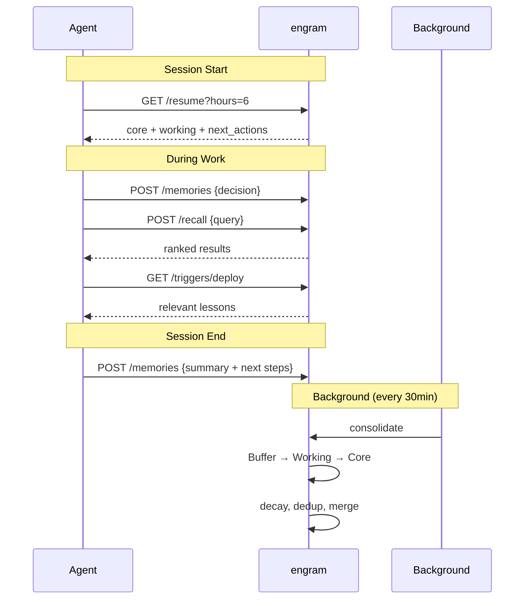

# engram

Persistent memory for AI agents. Store, forget, and recall like a brain.

## Why?

Most agent memory is just a vector database. Everything stays forever, retrieval is dumb similarity search, and there's no concept of what matters.

engram is different. It uses a three-layer model inspired by [how human memory actually works](https://en.wikipedia.org/wiki/Atkinson%E2%80%93Shiffrin_memory_model):

| Layer | Role | Behavior |
|-------|------|----------|
| **Buffer** | Short-term context | Decays in ~24h unless reinforced |
| **Working** | Active knowledge | Promoted from buffer by usage + LLM triage |
| **Core** | Identity & principles | Earned through repeated access, LLM quality gate |

You just store memories. The system figures out what's important and promotes it. Unused memories fade naturally. Lessons and procedures persist indefinitely.

Single binary, ~9 MB, no Docker, no Python, no external database.
## How It Works



## Setup

**For AI agents:** paste this into your agent session and let it handle the rest:

```
Set up engram (persistent memory) by following the guide at:
https://raw.githubusercontent.com/kael-bit/engram-rs/main/docs/SETUP.md
```

**For humans:** see [docs/SETUP.md](docs/SETUP.md) for step-by-step instructions covering Claude Code, OpenClaw, Codex, and other editors. Supports MCP tools or HTTP API integration.

### systemd (Production)

```ini
# /etc/systemd/system/engram.socket
[Unit]
Description=engram memory engine socket

[Socket]
ListenStream=3917
NoDelay=true

[Install]
WantedBy=sockets.target
```

```ini
# /etc/systemd/system/engram.service
[Unit]
Description=engram memory engine
After=network.target
Requires=engram.socket

[Service]
ExecStart=/usr/local/bin/engram
Environment=ENGRAM_DB=/var/lib/engram/engram.db
Environment=ENGRAM_API_KEY=your-secret-key
Environment=ENGRAM_LLM_URL=https://api.openai.com/v1/chat/completions
Environment=ENGRAM_LLM_KEY=sk-xxx
Environment=ENGRAM_EMBED_URL=https://api.openai.com/v1/embeddings
Environment=ENGRAM_EMBED_KEY=sk-xxx
Restart=always
RestartSec=1

[Install]
WantedBy=multi-user.target
```

Socket activation gives zero-downtime deploys — the socket stays open during restarts, queuing connections in the kernel.

```bash
sudo systemctl enable --now engram.socket engram
```

## Features

### Memory Types

Three kinds of memory with different decay behavior:

| Kind | Decay | Use Case |
|------|-------|----------|
| `semantic` | Normal | Facts, preferences, knowledge (default) |
| `episodic` | Normal | Events, experiences, time-bound context |
| `procedural` | Near-zero | Workflows, instructions, how-to — persists indefinitely |

```bash
curl -X POST http://localhost:3917/memories \
  -H 'Content-Type: application/json' \
  -d '{"content": "deploy with: cargo build --release && scp ...", "kind": "procedural"}'
```

### Fact Triples & Contradiction Resolution

engram extracts structured facts as (subject, predicate, object) triples from memories, enabling relationship queries and automatic contradiction detection:

```bash
# Store facts explicitly
curl -X POST http://localhost:3917/facts \
  -H 'Content-Type: application/json' \
  -d '{"facts": [{"subject": "alice", "predicate": "role", "object": "engineer"}]}'

# Query by entity
curl 'http://localhost:3917/facts?entity=alice'

# When a contradicting fact is inserted, the old one is auto-superseded
curl -X POST http://localhost:3917/facts \
  -H 'Content-Type: application/json' \
  -d '{"facts": [{"subject": "alice", "predicate": "role", "object": "manager"}]}'
# Response includes {"resolved": 1} — the old "engineer" fact is now timestamped as superseded

# View fact history
curl 'http://localhost:3917/facts/history?subject=alice&predicate=role'
```

Facts are also extracted automatically when using `/extract` or the LLM proxy.

### Injection Protection

Memories get injected into LLM context windows. Malicious content stored as a memory could act as a prompt injection. engram protects against this:

- **On insert**: content is scored for injection risk. High-risk memories (score ≥ 0.7) are tagged `suspicious`.
- **On recall**: suspicious memories are automatically downranked in scoring.
- **On output**: special tokens (`<|im_start|>`, `[INST]`, `<<SYS>>`, etc.) are stripped from recall/resume responses.

Detection covers instruction overrides, role-play injection, model-specific control tokens, and XML/tag escaping attempts.

### Hybrid Search

Recall combines multiple signals:

- **Semantic search**: cosine similarity on embeddings (requires AI)
- **FTS5 keyword search**: BM25 with jieba segmentation for Chinese and bigram tokenization for Japanese/Korean
- **Fact lookup**: exact entity matching via the facts table
- **Composite scoring**: `(0.6 × relevance + 0.2 × importance + 0.2 × recency) × layer_bonus`
- **Keyword affinity**: semantic-only results that lack any query terms get a 0.7× penalty — mitigates embedding model weaknesses with short CJK queries
- **Stop word filtering**: common words (的、是、了、the、is、etc.) are excluded from FTS queries to reduce noise
- **FTS relevance floor**: keyword matches require minimum relevance to contribute to dual-hit boosting
- **Score cap**: final scores are capped at 1.0 to prevent threshold confusion from stacked bonuses

Results are deduplicated across all search modes. When both semantic and keyword search find the same memory, relevance gets a boost.

### LLM Proxy

Sit between your tools and any LLM API. Memories are extracted automatically — no code changes needed.

```bash
ENGRAM_PROXY_UPSTREAM=https://api.openai.com \
./target/release/engram

# Point your tools at engram:
# Before: https://api.openai.com/v1/chat/completions
# After:  http://localhost:3917/proxy/v1/chat/completions
```

How it works:
1. Forwards requests and headers to upstream verbatim
2. Streams the response back with zero added latency
3. After the exchange completes, asynchronously extracts key facts/decisions/preferences
4. Stores extracted memories in the buffer layer (source: `proxy`, tagged `auto-extract`)

The proxy is selective — routine task details are skipped. Only user preferences, concrete decisions, lessons learned, and identity-defining facts are extracted.

### Session Recovery

One call to restore agent context on wake-up:

```bash
# Full resume
curl http://localhost:3917/resume?hours=4

# Token-efficient (recommended for agents)
curl 'http://localhost:3917/resume?hours=4&compact=true&budget=8000'
```

Returns structured sections: `core` (identity/permanent), `working` (active context), `recent` (time-windowed), `sessions` (session notes), `next_actions` (tagged next-action).

`compact=true` strips metadata, `budget=N` caps total output characters with priority-based truncation (core first, buffer last).

### Namespace Isolation

Multi-agent support — each agent gets its own memory space:

```bash
curl -X POST http://localhost:3917/memories \
  -H 'X-Namespace: agent-alpha' \
  -H 'Content-Type: application/json' \
  -d '{"content": "agent-alpha private context"}'
```

### Triggers

Pre-action safety recall. Tag memories with `trigger:action-name`, then query before risky operations:

```bash
# Store a lesson
curl -X POST http://localhost:3917/memories \
  -H 'Content-Type: application/json' \
  -d '{"content": "never force-push to main", "tags": ["trigger:git-push"]}'

# Before pushing, check
curl http://localhost:3917/triggers/git-push
```

### Background Maintenance

engram runs autonomously — no cron or external scheduler needed:

- **Auto-consolidation** every 30 minutes: promotes active memories, decays neglected ones, reconciles buffer updates against Working/Core
- **Proxy debounce flush**: extracts memories from buffered conversations after 30 seconds of silence (not a fixed timer — waits for natural conversation pauses)
- **Auto-audit** every 24 hours: LLM reviews all Working/Core memories for quality, merges duplicates, demotes stale entries
- **Graceful shutdown**: flushes all pending proxy windows before exit

## API Reference

| Method | Path | Description |
|--------|------|-------------|
| `GET` | `/` | Health + endpoint list |
| `GET` | `/health` | Health only (uptime, RSS, cache, integrity — no endpoints) |
| `GET` | `/stats` | Layer counts |
| `POST` | `/memories` | Create memory |
| `POST` | `/memories/batch` | Batch create |
| `GET` | `/memories` | List (`?layer=N&tag=X&ns=X&limit=50&offset=0`) |
| `GET` | `/memories/:id` | Get by id (prefix match supported) |
| `PATCH` | `/memories/:id` | Update content/tags/importance/kind |
| `DELETE` | `/memories/:id` | Delete |
| `DELETE` | `/memories` | Batch delete (`{"ids": [...]}` or `{"namespace": "x"}`) |
| `GET` | `/trash` | List soft-deleted memories (`?limit=100&offset=0`) |
| `POST` | `/trash/:id/restore` | Restore a memory from trash |
| `DELETE` | `/trash` | Permanently purge all trash |
| `POST` | `/recall` | Hybrid search (semantic + keyword + facts) |
| `GET` | `/search` | Quick keyword search (`?q=term&limit=10`) |
| `GET` | `/recent` | Recent memories (`?hours=2&limit=20`) |
| `GET` | `/resume` | Session recovery (`?hours=4&compact=true&budget=8000`) |
| `GET` | `/triggers/:action` | Pre-action recall |
| `POST` | `/consolidate` | Maintenance cycle (`{"merge": true}` for LLM merge) |
| `POST` | `/audit` | LLM-powered memory reorganization (requires AI) |
| `POST` | `/sanitize` | Check text for injection risk (`{"content": "..."}`) |
| `POST` | `/extract` | LLM text → structured memories |
| `POST` | `/repair` | Fix FTS index + backfill embeddings |
| `POST` | `/vacuum` | Reclaim disk space |
| `GET` | `/export` | Export as JSON (`?embed=true` includes vectors) |
| `POST` | `/import` | Import memories (skips existing ids) |
| `POST` | `/facts` | Insert fact triples |
| `GET` | `/facts` | Query facts by entity (`?entity=alice`) |
| `GET` | `/facts/all` | List all facts |
| `GET` | `/facts/conflicts` | Check conflicts (`?subject=X&predicate=Y`) |
| `GET` | `/facts/history` | Fact history (`?subject=X&predicate=Y`) |
| `DELETE` | `/facts/:id` | Delete fact |
| `ANY` | `/proxy/*` | Transparent LLM proxy |
| `POST` | `/proxy/flush` | Flush buffered proxy conversations for extraction |
| `GET` | `/proxy/window` | View proxy sliding window for current session |
| `GET` | `/ui` | Web dashboard |

## MCP Tools

| Tool | Description |
|------|-------------|
| `engram_store` | Store a memory with optional importance, tags, kind |
| `engram_recall` | Hybrid search with budget, time filters, reranking |
| `engram_recent` | List recent memories by time |
| `engram_resume` | Full session recovery bootstrap |
| `engram_search` | Quick keyword search |
| `engram_extract` | LLM-powered text → memories |
| `engram_consolidate` | Run promotion/decay/merge cycle |
| `engram_stats` | Layer counts and status |
| `engram_health` | Detailed health check |
| `engram_triggers` | Pre-action safety recall |
| `engram_repair` | Fix indexes and backfill embeddings |
| `engram_delete` | Delete a memory by ID |
| `engram_update` | Update importance, tags, or layer |
| `engram_trash` | List soft-deleted memories |
| `engram_restore` | Restore a memory from trash |

## Configuration

| Variable | Default | Description |
|----------|---------|-------------|
| `ENGRAM_PORT` | `3917` | Server port |
| `ENGRAM_DB` | `engram.db` | SQLite database path |
| `ENGRAM_API_KEY` | — | Bearer token auth (optional) |
| `ENGRAM_LLM_URL` | — | Chat completions endpoint (enables AI features) |
| `ENGRAM_LLM_KEY` | — | LLM API key |
| `ENGRAM_LLM_MODEL` | `gpt-4o-mini` | Default LLM model |
| `ENGRAM_MERGE_MODEL` | *(LLM_MODEL)* | Model for consolidation merge |
| `ENGRAM_EXTRACT_MODEL` | *(LLM_MODEL)* | Model for `/extract` |
| `ENGRAM_RERANK_MODEL` | *(LLM_MODEL)* | Model for recall re-ranking |
| `ENGRAM_EXPAND_MODEL` | *(LLM_MODEL)* | Model for query expansion |
| `ENGRAM_PROXY_MODEL` | *(LLM_MODEL)* | Model for proxy extraction |
| `ENGRAM_GATE_MODEL` | *(LLM_MODEL)* | Model for Core promotion gate + audit |
| `ENGRAM_EMBED_URL` | *(from LLM_URL)* | Embeddings endpoint |
| `ENGRAM_EMBED_KEY` | *(LLM_KEY)* | Embeddings API key |
| `ENGRAM_EMBED_MODEL` | `text-embedding-3-small` | Embedding model |
| `ENGRAM_CONSOLIDATE_MINS` | `30` | Auto-consolidation interval (0 = off) |
| `ENGRAM_AUTO_MERGE` | `false` | Enable LLM merge in auto-consolidation |
| `ENGRAM_AUTO_RERANK` | `false` | Auto-rerank all recall results via LLM |
| `ENGRAM_PROXY_UPSTREAM` | — | Upstream LLM URL (enables proxy) |
| `ENGRAM_PROXY_KEY` | — | Fallback API key for proxy |
| `ENGRAM_STRIP_MARKERS` | *(generic LLM tokens)* | Comma-separated boilerplate markers to strip from proxy context before extraction. Default: common LLM control tokens. Set this to your framework's system prompt headers. |
| `ENGRAM_WORKSPACE` | — | Default workspace tag for `/resume` |
| `ENGRAM_AUDIT_HOURS` | `24` | Background audit interval (0 = off) |
| `RUST_LOG` | `info` | Log level (`debug` for verbose) |

Per-component model overrides let you use cheap models for high-volume operations (proxy extraction, query expansion) while keeping stronger models for consolidation and audit.

## License

MIT
