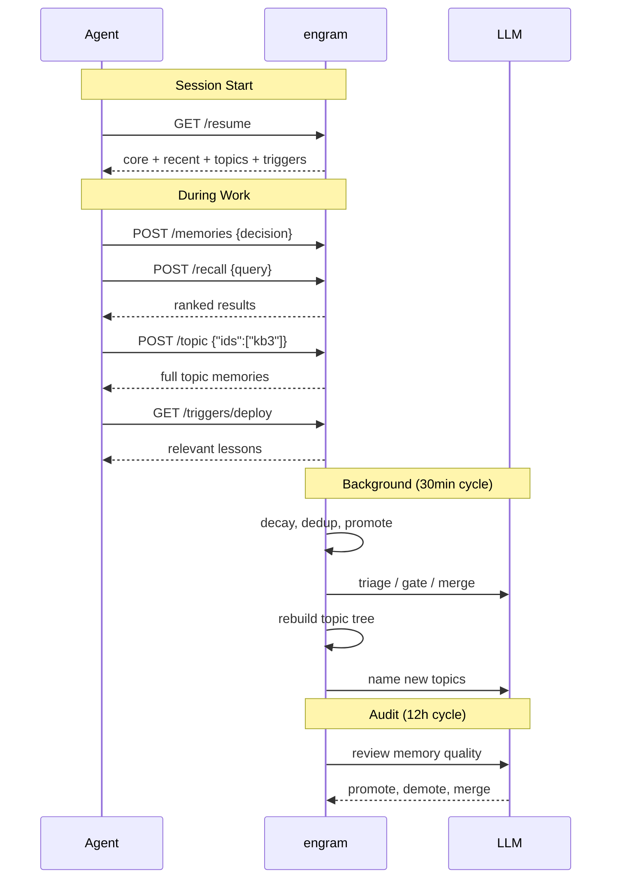

# engram

Persistent memory for AI agents. Store, forget, and recall — like a brain.

<p align="center">
  
</p>

## Why?

Most agent memory is just a vector database. Everything stays forever, retrieval is dumb similarity search, and there's no concept of what matters or how things relate.

engram organizes memory along two dimensions:

### Time — what survives

A three-layer lifecycle inspired by [how human memory actually works](https://en.wikipedia.org/wiki/Atkinson%E2%80%93Shiffrin_memory_model):

| Layer | Role | Behavior |
|-------|------|----------|
| **Buffer** | Short-term intake | All new memories land here. Unreinforced entries decay and get evicted |
| **Working** | Active knowledge | Promoted when accessed repeatedly or tagged as lessons/procedures. Never deleted — importance decays but memory persists |
| **Core** | Long-term identity | Promoted through sustained usage and LLM quality gate. Permanent |

You just store memories. The system figures out what's important and promotes it. Unused memories fade. Lessons persist. Duplicates reinforce instead of accumulating.

### Space — what connects

A self-organizing topic tree clusters related memories by semantic similarity, with LLM-powered naming:

```
Memory Architecture
├── Three-layer lifecycle [4]
├── Embedding pipeline [3]
└── Consolidation logic [5]
Deploy & Ops
├── CI/CD procedures [3]
└── Production incidents [2]
User Preferences [6]
Git Workflow [4]
```

The tree is hierarchical — related topics nest under shared parents. On session start, your agent gets a flattened index of leaf topics (the knowledge directory). See something relevant? Drill into it with `POST /topic`. The tree rebuilds automatically as memories change.

**Time tells you what matters. Space tells you what's related.** Together, they give an agent something closer to understanding than a flat list of embeddings ever could.

Single binary, ~10 MB, ~100 MB RSS in production. No Docker, no Python, no external database.

## How It Works



## Requirements

An **OpenAI-compatible or Anthropic-native API** for embeddings and LLM calls. Set `ENGRAM_LLM_URL` and `ENGRAM_LLM_KEY`. For Anthropic, also set `ENGRAM_LLM_PROVIDER=anthropic`.

Without an LLM, engram still works — keyword search and heuristic lifecycle only. You lose the smart parts (triage, merge, topic naming, audit).

## Install

```bash
# macOS / Linux
curl -fsSL https://raw.githubusercontent.com/kael-bit/engram-rs/main/install.sh | bash

# Windows (PowerShell)
irm https://raw.githubusercontent.com/kael-bit/engram-rs/main/install.ps1 | iex
```

The installer walks you through download, configuration, and startup interactively.

**For AI agents** — paste this into your session:

```
Set up engram (persistent memory) by following the guide at:
https://raw.githubusercontent.com/kael-bit/engram-rs/main/docs/SETUP.md
```

## Features

### Session Recovery

One call to restore context on wake-up or after compaction:

| Section | What it gives you |
|---------|-------------------|
| **Core** | Full text of permanent rules and identity — never truncated |
| **Recent** | Recently changed memories for short-term continuity |
| **Topics** | Named topic index — browse by subject, drill into any cluster |
| **Triggers** | Pre-action safety tags — auto-surface lessons before risky operations |

### Hybrid Search

Semantic embeddings + BM25 keyword search (with [jieba](https://github.com/messense/jieba-rs) for CJK) → single ranked result set. Unified scoring: `0.5 × relevance + 0.3 × memory_weight + 0.2 × recency`, where `memory_weight = (importance + rep_bonus + access_bonus) × kind_boost × layer_boost`. Embedding cache for repeat queries (<15ms).

### Memory Types

| Kind | Decay | Use Case |
|------|-------|----------|
| `semantic` | Normal | Knowledge, preferences, decisions (default) |
| `episodic` | Normal | Events, experiences, time-bound context |
| `procedural` | Never | Workflows, instructions, how-to — persists indefinitely |

### Namespace Isolation

One instance, multiple projects. Each workspace gets its own memory space with shared access to a `default` namespace for cross-project knowledge.

### Background Maintenance

Fully autonomous, activity-driven — no cron needed, no wasted cycles when idle:

- **Consolidation** (30min, skipped when idle): promote, decay, dedup, merge, rebuild topic tree
- **Audit** (12h, skipped when idle): LLM reviews memory quality, merges duplicates, demotes stale entries

## MCP & API

17 MCP tools for Claude Code, Cursor, Windsurf, OpenClaw, and others — see [docs/MCP.md](docs/MCP.md).

HTTP API and configuration: [docs/SETUP.md](docs/SETUP.md).

## License

MIT
