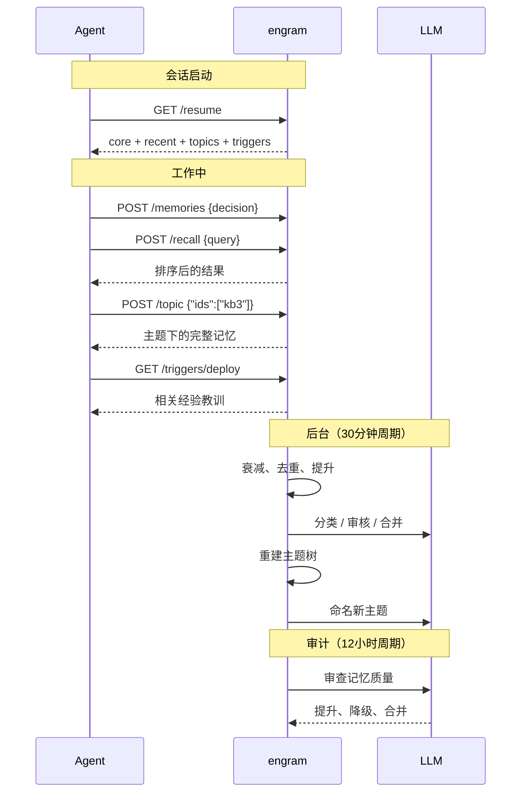

# engram

AI agent 的持久记忆。存储、衰减、检索 —— 像大脑一样工作。

<p align="center">
  
</p>

## 为什么做这个？

大多数 agent 记忆就是个向量数据库：什么都存着不删，检索靠纯相似度匹配，没有"什么重要"和"什么相关"的概念。

engram 从两个维度组织记忆：

### 时间 — 什么能留下来

受[人类记忆模型](https://en.wikipedia.org/wiki/Atkinson%E2%80%93Shiffrin_memory_model)启发的三层生命周期：

| 层级 | 角色 | 行为 |
|------|------|------|
| **Buffer** | 短期缓冲 | 所有新记忆先进这里。不被访问的会自然衰减淘汰 |
| **Working** | 工作记忆 | 被反复访问或标记为经验/流程后提升进来。永不删除——重要性会降但记忆始终保留 |
| **Core** | 长期身份 | 经过持续使用和 LLM 质量审核后提升。永久保留 |

你只管存，系统自动判断什么重要、什么该提升。没用的沉底，经验教训留住，重复内容合并增强而不是堆积。

### 空间 — 什么有关联

自组织的主题树通过语义相似度自动聚类，LLM 命名：

```
Memory Architecture
├── Three-layer lifecycle [4]
├── Embedding pipeline [3]
└── Consolidation logic [5]
Deploy & Ops
├── CI/CD procedures [3]
└── Production incidents [2]
User Preferences [6]
Git Workflow [4]
```

树是分层的——相关主题嵌套在共同父节点下。会话开始时，agent 拿到一个叶子主题的扁平索引（知识目录）。看到相关的？用 `POST /topic` 展开详情。记忆变化时主题树自动重建。

**时间告诉你什么重要，空间告诉你什么相关。** 两者结合，比一堆扁平的 embedding 列表更接近"理解"。

单二进制文件，~10 MB，生产环境 ~100 MB 内存。不依赖 Docker、Python、外部数据库。

## 工作原理



## 环境要求

需要 **OpenAI 兼容或 Anthropic 原生 API** 来做 embedding 和 LLM 调用。设置 `ENGRAM_LLM_URL` 和 `ENGRAM_LLM_KEY`。Anthropic 还需设置 `ENGRAM_LLM_PROVIDER=anthropic`。

没有 LLM 也能用——只有关键词搜索和规则驱动的生命周期。智能部分（分类、合并、主题命名、审计）需要 LLM。

## 安装

```bash
# macOS / Linux
curl -fsSL https://raw.githubusercontent.com/kael-bit/engram-rs/main/install.sh | bash

# Windows (PowerShell)
irm https://raw.githubusercontent.com/kael-bit/engram-rs/main/install.ps1 | iex
```

安装器会交互式引导你完成下载、配置和启动。

### Docker

```bash
docker run -d --name engram \
  -p 3917:3917 \
  -v engram-data:/data \
  -e ENGRAM_LLM_URL=https://api.openai.com/v1 \
  -e ENGRAM_LLM_KEY=sk-... \
  ghcr.io/kael-bit/engram-rs:latest
```

**给 AI agent 用** — 把这段贴到你的 agent 会话里：

```
Set up engram (persistent memory) by following the guide at:
https://raw.githubusercontent.com/kael-bit/engram-rs/main/docs/SETUP.md
```

## 功能

### 会话恢复

一次调用恢复上下文，适用于唤醒或上下文压缩后：

| 区块 | 内容 |
|------|------|
| **Core** | 永久规则和身份的完整文本——不截断 |
| **Recent** | 最近变更的记忆，保持短期连续性 |
| **Topics** | 主题索引——按主题浏览，按需展开任意聚类 |
| **Triggers** | 操作前安全标签——在危险操作前自动浮现相关教训 |

### 混合搜索

语义 embedding + BM25 关键词搜索（通过 [jieba](https://github.com/messense/jieba-rs) 支持中文分词）→ 统一排序结果。评分公式：`0.5 × 相关度 + 0.3 × 记忆权重 + 0.2 × 时效性`，其中 `记忆权重 = (重要性 + 重复加成 + 访问加成) × 类型加成 × 层级加成`。重复查询缓存命中 <15ms。

### 记忆类型

| 类型 | 衰减 | 用途 |
|------|------|------|
| `semantic` | 正常 | 知识、偏好、决策（默认） |
| `episodic` | 正常 | 事件、经历、时效性上下文 |
| `procedural` | 永不 | 工作流、指令、操作手册——永久保留 |

### 命名空间隔离

一个实例，多个项目。每个工作区有独立的记忆空间，同时共享 `default` 命名空间的跨项目知识。

### 后台维护

全自动、按需驱动——不需要 cron，空闲时零消耗：

- **整理**（30分钟周期，空闲时跳过）：提升、衰减、去重、合并、重建主题树
- **审计**（12小时周期，空闲时跳过）：LLM 审查记忆质量，合并重复，降级过时条目

## MCP 和 API

17 个 MCP 工具，支持 Claude Code、Cursor、Windsurf、OpenClaw 等——详见 [docs/MCP.md](docs/MCP.md)。

HTTP API 和配置说明：[docs/SETUP.md](docs/SETUP.md)。

## License

MIT
